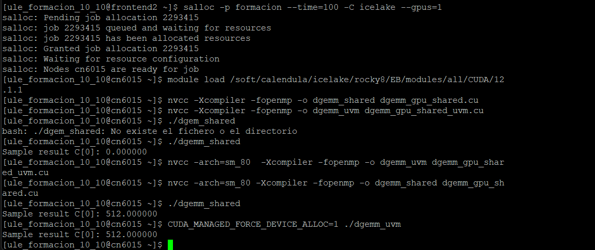

# Multiplicación de Matrices en CUDA

Este proyecto resuelve dos ejercicios de multiplicación de matrices en GPU usando CUDA:

- ✅ **Ejercicio 1:** Uso de memoria compartida (`dgemm_gpu_shared_completed.cu`)
- ✅ **Ejercicio 2:** Uso de Unified Memory (`dgemm_gpu_shared_uvm_completed.cu`)

---

## 🔧 Compilación

```bash
nvcc -Xcompiler -fopenmp -o dgemm_shared dgemm_gpu_shared_completed.cu
nvcc -Xcompiler -fopenmp -o dgemm_uvm dgemm_gpu_shared_uvm_completed.cu
```

---

## ▶️ Ejecución

### Ejercicio 1 (Memoria compartida)

```bash
./dgemm_shared
```

### Ejercicio 2 (Memoria unificada)

```bash
CUDA_MANAGED_FORCE_DEVICE_ALLOC=1 ./dgemm_uvm
```

---

## 📸 Captura de Salida



---

## 🧠 Notas

- Ambos programas calculan correctamente `C[0] = 512.000000`, lo cual es esperable ya que todas las entradas de las matrices eran `1.0f` y se multiplican matrices de tamaño 512x512.
- En el ejercicio 2, se fuerza la asignación en dispositivo con `CUDA_MANAGED_FORCE_DEVICE_ALLOC=1`.

---

## 📁 Archivos incluidos

- `dgemm_gpu_shared_completed.cu`
- `dgemm_gpu_shared_uvm_completed.cu`
- `salida.png`